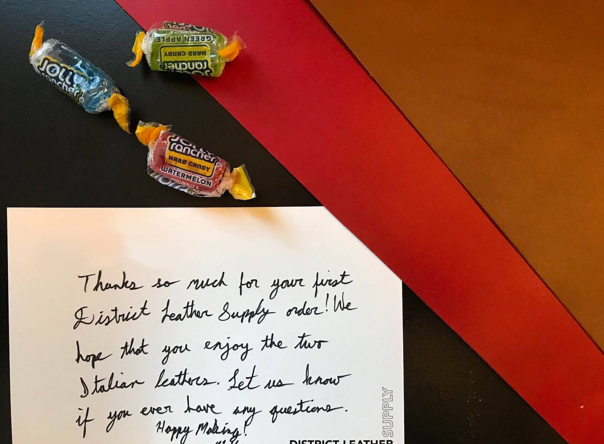

Shopping for leather can be stressful, there are seemingly endless varieties of leather available and almost as many companies wanting to sell it to you. So how do you know where to start? Hopefully this curated list of the Top 10 leather supplies in the industry will give you a good jumping off point and help you find exactly what you need.

## 1. District Leather Supply

District Leather Supply is one of my favorite companies to buy my leather from. They stock a wide variety of leathers in a range of types, weights, and colors. Their product photography really sets them apart from their competition, with every product having a high resolution image showing exactly what the leather will look like so you know it will work for your project. 

What really sets District Leather apart is their customer service. With my last order I not only recieved a hand written thank you card but also some hard candy. Certainly a great way to create a loyal customer base.

https://districtleathersupply.com/

## 2. Tandy Leather

Since their founding in 1919, Tandy Leather has becomes a staple in the world of leathercraft. If you can't find the leather you want online you can visit one of their 108 locations across the US and pick out your supplies in person. Be sure to check out their Sale page for some great deals to build your toolkit.

https://www.tandyleather.com

## 3. Rocky Mountain Leather Supply

If you're looking to try out a variety of leathers to find your favorite you may want to a trip to Rocky Mountain Leather Supply. Whether you're looking for some Chevre Goat Leather from France or Shell Cordorovan, the most expensive and revered leather in the industry, you can get it Rocky Mountain. They allow you to buy as little as one square foot of most of their leathers, and even stock sample books for a few, allowing you to test multiple leathers without breaking the bank.

Rocky Mountain also includes free splitting on most of their leathers allowing you to use your favorites on any project you work on.

https://www.rmleathersupply.com

## 4. Springfield Leather Supply

Once I find a leather I really like I typically head over to Springfield leather to buy more of it. While other shops may have good deals on small samples, Springlied has great deal on sides and full hides of leather. The folks at Springfield also do a great job of bringing the feeling of a small family run business to the web with their blog "Kevin's Storytime" and pictures of their dogs featured across the site. It truly makes you feel welcome and gives a you a look behind the scenes.

https://www.springfieldleather.com/

## 5. Weaver Leather Supply

Like the other suppliers listed here, Weaver Leather Supply has a great selection of leather at great prices. However, it's not their product that convinced me to include them in this list. Weaver Leather Supply's knowledgebase truly puts them in a league of their own. Their extensive online blog, tutorials, and YouTube videos will teach things beginners and experts alike, and thier in-house expert Chuck Dorsett is one of the most knowledgeable and passionate leathercrafters you will find. Stop by Weaver Leather Supply's site if you're wanting to learn something and take a look at their steals and deals while you're there.

https://www.weaverleathersupply.com/

## 6. Maverick Leather Supply

Maverick Leather from Bend, Oregon may be newer to the craft, founded in just 2006, but they wasted no time building one of the largest selections of any online leather supply store. Goat, deer, pigs, and even kangaroo can be had for a great price. Weaver Leather also sells Horween "seconds", allowing you to get one of the worlds best leathers without stretching the wallet by having a change at pieces that didn't quite make the cut. 

https://www.maverickleathercompany.com/

## 7. Brettuns Village
Every Wednesday at 8am EST make your way over to Brettuns Villiage to check out their deal of the week. A new deal is added every week and typically the savings are too good to pass up. Aside from the deals, Brettuns Village stands out wit their "I only want a piece of leather" form, allowing you to specify the exact size of leather you need for your next project. You can also order up to 10 samples of any of their leathers for just $5.00 so you can try it before you buy it.

While you're there, check out their selection of antique trunks if you want a beautiful blast from the past.

https://www.brettunsvillage.com

## 8. Zach White Leather Company

Another one of my favorite suppliers is Zack White Leather Co. Their online store has an impressive amount of leather as well as tools and supplies, allowing you to buy everything you need for any project, even if what you need is [a whole raccon](https://www.zackwhite.com/North-American-Raccoon_p_4816.html).

https://www.zackwhite.com/

## 9. Metropolitan Leather

This listing is specifically for our UK readers (although they still deliver to the rest of the world). It can be difficult to find a leather supplier abroad but for just £12.50 delivery fee to the UK mailand you Metropolitan Leather gives you access to a great selection of both vegetable and chrome tanned leather. If you're not sure what to get, start with thier [free brochure](https://www.metropolitanleather.com/Metropolitan-Leather-Brochure) listing thier entire inventory of leather and color varieties.

https://www.metropolitanleather.com

## 10. eBay

Last but not least, eBay may not be you first thought when it comes to high quality leather suppliers, but with millions of listings added daily you're bound to find a few gems if you know where to dig. A great strategy to save some money is to start your search on any of the other stores I've listed above, then once you find the leather you want to buy search it on eBay first to see if you can find it cheaper. It may not work everytime but when it comes to buying your leather supply every dollar counts. Be sure to check seller feedback before you buy!

https://www.ebay.com/

###Conclusion

That's a wrap for my Top 10 list of leather suppliers. At the end of the day you can't really go wrong with any of the suppliers listed above and there are many more great suppliers that didn't quite make the list. So take some time to visit each of the links above see what deals you can find, but be warned, once you start you may buying more leather than you can use!